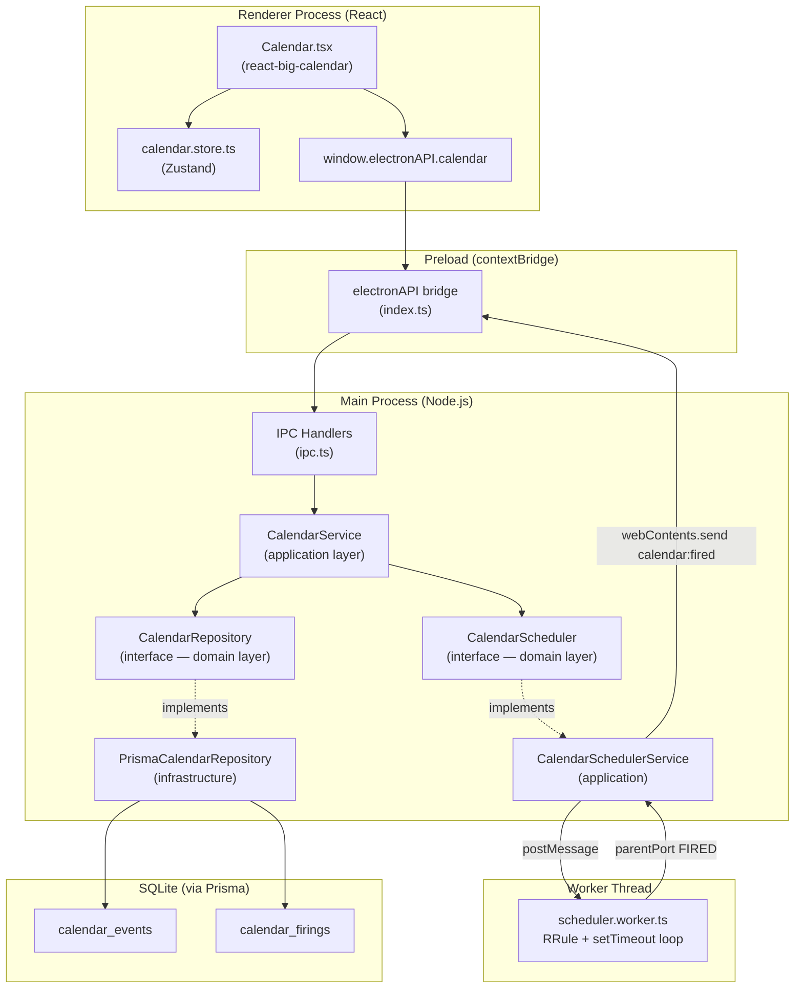
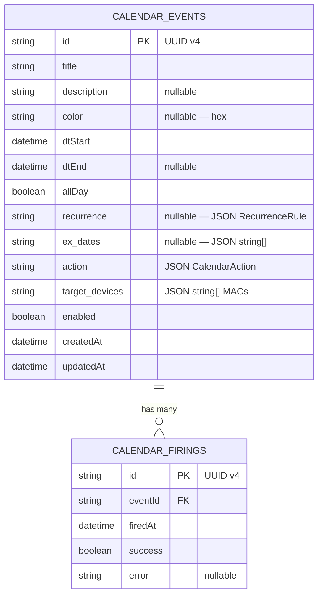
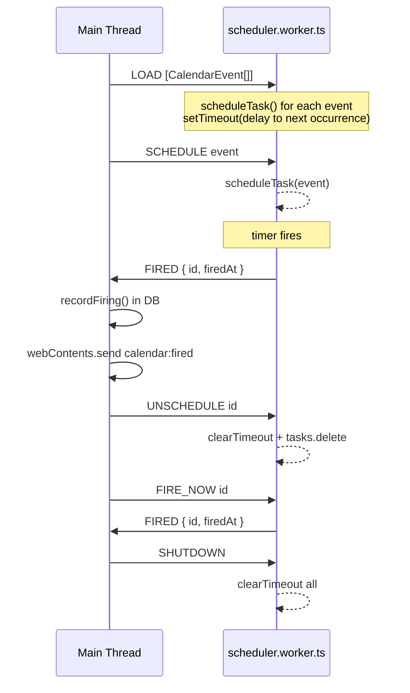
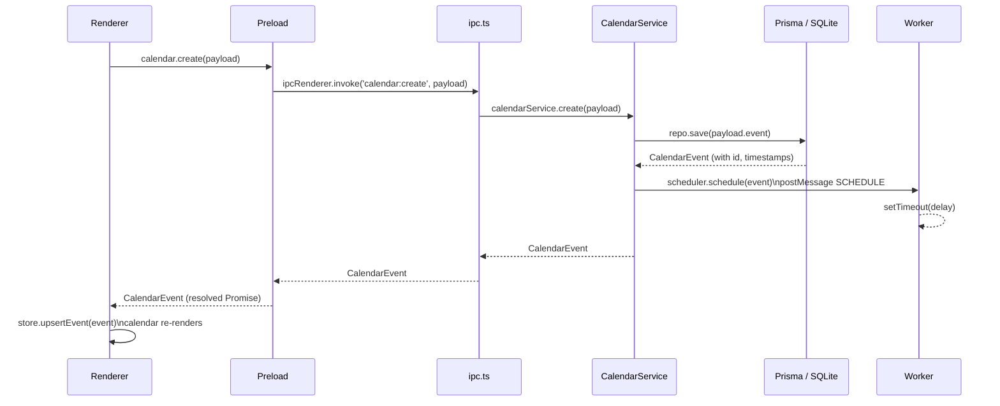

# Calendar Feature — Integration Guide

## Table of Contents

1. [Overview](#overview)
2. [Current State (Phase 1 — Frontend)](#current-state)
3. [Data Model](#data-model)
4. [Database Schema (Prisma + SQLite)](#database-schema)
5. [Backend Module Architecture (Clean Architecture + SOLID)](#backend-module-architecture)
6. [IPC Contract](#ipc-contract)
7. [Calendar Scheduler Worker](#calendar-scheduler-worker)
8. [Main Process Integration](#main-process-integration)
9. [Full Request/Response Flow](#full-requestresponse-flow)
10. [Architecture Diagrams](#architecture-diagrams)
11. [Design Patterns Used](#design-patterns-used)
12. [Recommendations for the Backend Developer](#recommendations-for-the-backend-developer)
13. [Context for AI-assisted Development](#context-for-ai-assisted-development)

---

## Overview

The Calendar feature lets operators schedule timed events on AIP devices. Each event carries an **action** (play a file, play a playlist, stream online audio, or activate a scene) and targets one or more devices by MAC address.

Events support full **RFC 5545-compatible recurrence** (minutely, hourly, daily, weekly, monthly, yearly) with configurable end conditions and exclusion dates.

The system runs inside an **Electron** desktop application. The backend is a **Node.js main process** module. The frontend is a **React** renderer using `react-big-calendar` and `rrule` for display and expansion.

---

## Current State

Phase 1 is **frontend-complete**. The main process uses an in-memory `Map<string, CalendarEvent>` as a mock store. All IPC handlers are wired and functional. The renderer can list, create, update, delete, and toggle events.

**To replace the mock store with a real database**, implement the modules described in sections 4–7 and swap the in-memory handlers in `src/main/ipc.ts` for repository calls.

---

## Data Model

Defined in `src/shared/calendar.ts`. This file is imported by both the main process and the renderer — it must remain free of Node-only or browser-only imports.

```
CalendarEvent
  id            string (UUID v4)
  title         string
  description   string?
  color         string?          hex color for the UI chip
  dtStart       string           ISO 8601 UTC
  dtEnd         string?          ISO 8601 UTC — defines playback end / event duration
  allDay        boolean?
  recurrence    RecurrenceRule?
  exDates       string[]?        ISO 8601 dates excluded from recurrence
  action        CalendarAction   discriminated union (file | playlist | online | scene)
  targetDevices string[]         MACs — empty = all devices
  enabled       boolean
  createdAt     string           ISO 8601 UTC
  updatedAt     string           ISO 8601 UTC

RecurrenceRule
  freq          'minutely' | 'hourly' | 'daily' | 'weekly' | 'monthly' | 'yearly'
  interval      number           repeat every N units
  byDay         Weekday[]?       for weekly: MO TU WE TH FR SA SU
  byMonthDay    number?          for monthly: 1–31
  end           RecurrenceEnd    { type: 'never' } | { type: 'count', count } | { type: 'until', until }

CalendarAction (discriminated union)
  { type: 'file',     filePath, fileName? }
  { type: 'playlist', playlistId, playlistName? }
  { type: 'online',   streamUrl, streamName? }
  { type: 'scene',    sceneId, sceneName? }
```

The `action` and `recurrence` fields are stored as **JSON columns** in SQLite. This avoids the overhead of multiple join tables while keeping the data portable and queryable.

---

## Database Schema (Prisma + SQLite)

Create `prisma/schema.prisma`:

```prisma
generator client {
  provider = "prisma-client-js"
}

datasource db {
  provider = "sqlite"
  url      = env("DATABASE_URL")   // e.g. file:./aip-go-pro.db
}

model CalendarEvent {
  id            String   @id @default(uuid())
  title         String
  description   String?
  color         String?
  dtStart       DateTime
  dtEnd         DateTime?
  allDay        Boolean  @default(false)

  // RFC 5545 recurrence rule — stored as JSON string
  recurrenceJson String?  @map("recurrence")

  // Excluded dates — stored as JSON array of ISO strings
  exDatesJson    String?  @map("ex_dates")

  // CalendarAction discriminated union — stored as JSON string
  actionJson     String   @map("action")

  // MACs — stored as JSON array of strings
  targetDevicesJson String @default("[]") @map("target_devices")

  enabled   Boolean  @default(true)
  createdAt DateTime @default(now())
  updatedAt DateTime @updatedAt

  // fired history (optional — for audit log)
  firings CalendarFiring[]

  @@map("calendar_events")
}

model CalendarFiring {
  id        String   @id @default(uuid())
  eventId   String
  firedAt   DateTime @default(now())
  success   Boolean  @default(true)
  error     String?

  event CalendarEvent @relation(fields: [eventId], references: [id], onDelete: Cascade)

  @@map("calendar_firings")
}
```

### Why JSON columns for action / recurrence?

- `action` is a **discriminated union** with different required fields per type. Normalising it into separate tables would require 4 nullable joined tables with a type discriminator column.
- `recurrence` maps 1-to-1 to a value object. It is never queried independently (filtering is done in-process by the scheduler).
- Storing as JSON keeps migrations simple and the data human-readable in the SQLite file.

### Migration

```bash
npx prisma migrate dev --name init-calendar
npx prisma generate
```

Set `DATABASE_URL` in the Electron main process before instantiating the Prisma client:

```typescript
// src/main/index.ts
process.env.DATABASE_URL = `file:${path.join(app.getPath('userData'), 'aip-go-pro.db')}`
```

---

## Backend Module Architecture

Follow **Clean Architecture** layers. Each layer depends only on the layer below it.

```
src/main/calendar/
  domain/
    CalendarEvent.ts          Pure domain types + value objects (no Prisma, no Electron)
    CalendarRepository.ts     Repository interface (ISP, DIP)
    CalendarScheduler.ts      Scheduler interface (DIP)
  infrastructure/
    PrismaCalendarRepository.ts   Prisma implementation of CalendarRepository
    CalendarEventMapper.ts        Prisma record <-> domain model mapping
  application/
    CalendarService.ts        Use-case orchestrator (SRP, OCP)
    CalendarSchedulerService.ts   Scheduler lifecycle management
  worker/
    scheduler.worker.ts       Node.js worker_thread — see section 7
  index.ts                    Wires everything together; called by registerIpcHandlers()
```

### Domain layer — `CalendarRepository` interface

```typescript
// src/main/calendar/domain/CalendarRepository.ts

import type { CalendarEvent, CalendarEventId } from '../../../shared/calendar'

/** Port (interface) for calendar event persistence. Follows DIP. */
export interface CalendarRepository {
  findAll(): Promise<CalendarEvent[]>
  findById(id: CalendarEventId): Promise<CalendarEvent | null>
  findEnabled(): Promise<CalendarEvent[]>
  save(event: Omit<CalendarEvent, 'id' | 'createdAt' | 'updatedAt'>): Promise<CalendarEvent>
  update(id: CalendarEventId, changes: Partial<CalendarEvent>): Promise<CalendarEvent | null>
  delete(id: CalendarEventId): Promise<boolean>
  recordFiring(eventId: CalendarEventId, success: boolean, error?: string): Promise<void>
}
```

### Infrastructure layer — `PrismaCalendarRepository`

```typescript
// src/main/calendar/infrastructure/PrismaCalendarRepository.ts

import { PrismaClient } from '@prisma/client'
import { randomUUID } from 'crypto'
import type { CalendarRepository } from '../domain/CalendarRepository'
import type { CalendarEvent, CalendarEventId } from '../../../shared/calendar'
import { CalendarEventMapper } from './CalendarEventMapper'

export class PrismaCalendarRepository implements CalendarRepository {
  constructor(private readonly prisma: PrismaClient) {}

  async findAll(): Promise<CalendarEvent[]> {
    const rows = await this.prisma.calendarEvent.findMany({ orderBy: { dtStart: 'asc' } })
    return rows.map(CalendarEventMapper.toDomain)
  }

  async findById(id: CalendarEventId): Promise<CalendarEvent | null> {
    const row = await this.prisma.calendarEvent.findUnique({ where: { id } })
    return row ? CalendarEventMapper.toDomain(row) : null
  }

  async findEnabled(): Promise<CalendarEvent[]> {
    const rows = await this.prisma.calendarEvent.findMany({ where: { enabled: true } })
    return rows.map(CalendarEventMapper.toDomain)
  }

  async save(data: Omit<CalendarEvent, 'id' | 'createdAt' | 'updatedAt'>): Promise<CalendarEvent> {
    const row = await this.prisma.calendarEvent.create({
      data: CalendarEventMapper.toPrismaCreate({ ...data, id: randomUUID() }),
    })
    return CalendarEventMapper.toDomain(row)
  }

  async update(id: CalendarEventId, changes: Partial<CalendarEvent>): Promise<CalendarEvent | null> {
    try {
      const row = await this.prisma.calendarEvent.update({
        where: { id },
        data: CalendarEventMapper.toPrismaUpdate(changes),
      })
      return CalendarEventMapper.toDomain(row)
    } catch {
      return null
    }
  }

  async delete(id: CalendarEventId): Promise<boolean> {
    try {
      await this.prisma.calendarEvent.delete({ where: { id } })
      return true
    } catch {
      return false
    }
  }

  async recordFiring(eventId: CalendarEventId, success: boolean, error?: string): Promise<void> {
    await this.prisma.calendarFiring.create({ data: { eventId, success, error } })
  }
}
```

### Infrastructure layer — `CalendarEventMapper`

```typescript
// src/main/calendar/infrastructure/CalendarEventMapper.ts

import type { CalendarEvent as PrismaCalendarEvent } from '@prisma/client'
import type { CalendarEvent, CalendarAction, RecurrenceRule } from '../../../shared/calendar'

export class CalendarEventMapper {
  static toDomain(row: PrismaCalendarEvent): CalendarEvent {
    return {
      id:            row.id,
      title:         row.title,
      description:   row.description ?? undefined,
      color:         row.color ?? undefined,
      dtStart:       row.dtStart.toISOString(),
      dtEnd:         row.dtEnd?.toISOString(),
      allDay:        row.allDay,
      recurrence:    row.recurrenceJson ? JSON.parse(row.recurrenceJson) as RecurrenceRule : undefined,
      exDates:       row.exDatesJson   ? JSON.parse(row.exDatesJson)   as string[]        : undefined,
      action:        JSON.parse(row.actionJson) as CalendarAction,
      targetDevices: JSON.parse(row.targetDevicesJson) as string[],
      enabled:       row.enabled,
      createdAt:     row.createdAt.toISOString(),
      updatedAt:     row.updatedAt.toISOString(),
    }
  }

  static toPrismaCreate(event: CalendarEvent) {
    return {
      id:                event.id,
      title:             event.title,
      description:       event.description,
      color:             event.color,
      dtStart:           new Date(event.dtStart),
      dtEnd:             event.dtEnd ? new Date(event.dtEnd) : null,
      allDay:            event.allDay ?? false,
      recurrenceJson:    event.recurrence ? JSON.stringify(event.recurrence) : null,
      exDatesJson:       event.exDates   ? JSON.stringify(event.exDates)    : null,
      actionJson:        JSON.stringify(event.action),
      targetDevicesJson: JSON.stringify(event.targetDevices),
      enabled:           event.enabled,
    }
  }

  static toPrismaUpdate(changes: Partial<CalendarEvent>) {
    const data: Record<string, unknown> = {}
    if (changes.title       !== undefined) data.title             = changes.title
    if (changes.description !== undefined) data.description       = changes.description
    if (changes.color       !== undefined) data.color             = changes.color
    if (changes.dtStart     !== undefined) data.dtStart           = new Date(changes.dtStart)
    if (changes.dtEnd       !== undefined) data.dtEnd             = new Date(changes.dtEnd)
    if (changes.allDay      !== undefined) data.allDay            = changes.allDay
    if (changes.recurrence  !== undefined) data.recurrenceJson    = JSON.stringify(changes.recurrence)
    if (changes.exDates     !== undefined) data.exDatesJson       = JSON.stringify(changes.exDates)
    if (changes.action      !== undefined) data.actionJson        = JSON.stringify(changes.action)
    if (changes.targetDevices !== undefined) data.targetDevicesJson = JSON.stringify(changes.targetDevices)
    if (changes.enabled     !== undefined) data.enabled           = changes.enabled
    return data
  }
}
```

### Application layer — `CalendarService`

```typescript
// src/main/calendar/application/CalendarService.ts

import type { CalendarRepository }  from '../domain/CalendarRepository'
import type { CalendarScheduler }   from '../domain/CalendarScheduler'
import type {
  CalendarEvent,
  CalendarEventId,
  CalendarCreatePayload,
  CalendarUpdatePayload,
  CalendarTogglePayload,
} from '../../../shared/calendar'

/**
 * CalendarService is the single entry point for all calendar use-cases.
 * It follows SRP (one class, one reason to change) and OCP (new use-cases
 * extend via repository + scheduler interfaces, never by modifying this class).
 */
export class CalendarService {
  constructor(
    private readonly repo: CalendarRepository,
    private readonly scheduler: CalendarScheduler,
  ) {}

  list(): Promise<CalendarEvent[]> {
    return this.repo.findAll()
  }

  get(id: CalendarEventId): Promise<CalendarEvent | null> {
    return this.repo.findById(id)
  }

  async create(payload: CalendarCreatePayload): Promise<CalendarEvent> {
    const event = await this.repo.save(payload.event)
    if (event.enabled) this.scheduler.schedule(event)
    return event
  }

  async update(payload: CalendarUpdatePayload): Promise<CalendarEvent | null> {
    const updated = await this.repo.update(payload.id, payload.changes)
    if (!updated) return null
    this.scheduler.reschedule(updated)
    return updated
  }

  async delete(id: CalendarEventId): Promise<{ removed: boolean }> {
    this.scheduler.unschedule(id)
    const removed = await this.repo.delete(id)
    return { removed }
  }

  async toggle(payload: CalendarTogglePayload): Promise<CalendarEvent | null> {
    const updated = await this.repo.update(payload.id, { enabled: payload.enabled })
    if (!updated) return null
    if (payload.enabled) this.scheduler.schedule(updated)
    else                 this.scheduler.unschedule(payload.id)
    return updated
  }

  async trigger(id: CalendarEventId): Promise<{ fired: boolean; event?: CalendarEvent }> {
    const event = await this.repo.findById(id)
    if (!event) return { fired: false }
    this.scheduler.fireNow(event)
    return { fired: true, event }
  }

  async loadAll(): Promise<void> {
    const events = await this.repo.findEnabled()
    for (const event of events) this.scheduler.schedule(event)
  }
}
```

---

## IPC Contract

Defined in `src/shared/ipc.ts`. These channels connect the renderer to the main process:

| Channel | Direction | Payload | Response |
|---|---|---|---|
| `calendar:list` | invoke | — | `CalendarEvent[]` |
| `calendar:get` | invoke | `id: string` | `CalendarEvent \| null` |
| `calendar:create` | invoke | `CalendarCreatePayload` | `CalendarEvent` |
| `calendar:update` | invoke | `CalendarUpdatePayload` | `CalendarEvent \| null` |
| `calendar:delete` | invoke | `id: string` | `{ removed: boolean }` |
| `calendar:toggle` | invoke | `CalendarTogglePayload` | `CalendarEvent \| null` |
| `calendar:trigger` | invoke | `id: string` | `{ fired: boolean; event? }` |
| `calendar:fired` | **push** (main → renderer) | `id: string, firedAt: string` | — |

The `calendar:fired` channel is a **push event** emitted by the scheduler when an event fires. The renderer subscribes via `window.electronAPI.calendar.onEventFired(cb)` to update the UI in real time.

---

## Calendar Scheduler Worker

The scheduler runs in a **Node.js `worker_threads` Worker** (`scheduler.worker.ts`) to keep the main process UI-thread free. The worker owns the tick loop and all timer logic.

### Why a worker thread?

- The main process event loop handles IPC, Electron APIs, and OS events. A tight timer loop that re-evaluates hundreds of recurring rules every minute would add latency to all IPC responses.
- Workers have their own event loop. A setTimeout/setInterval loop in a worker never blocks Electron's main thread.
- The worker communicates with the main thread via `parentPort.postMessage` (cheap structured clone — no Electron IPC overhead).

### Worker interface

```typescript
// src/main/calendar/worker/scheduler.worker.ts

import { parentPort, workerData } from 'worker_threads'
import { RRule } from 'rrule'
import type { CalendarEvent } from '../../../../shared/calendar'

// Messages sent FROM the main thread TO the worker
type WorkerInbound =
  | { type: 'LOAD';        events: CalendarEvent[] }
  | { type: 'SCHEDULE';    event:  CalendarEvent   }
  | { type: 'RESCHEDULE';  event:  CalendarEvent   }
  | { type: 'UNSCHEDULE';  id:     string          }
  | { type: 'FIRE_NOW';    id:     string          }
  | { type: 'SHUTDOWN' }

// Messages sent FROM the worker TO the main thread
type WorkerOutbound =
  | { type: 'FIRED'; id: string; firedAt: string }
  | { type: 'ERROR'; id: string; message: string }

// Scheduled task entry
interface ScheduledTask {
  event:   CalendarEvent
  timerId: ReturnType<typeof setTimeout> | null
}

const tasks = new Map<string, ScheduledTask>()

function getNextOccurrence(event: CalendarEvent): Date | null {
  if (!event.recurrence) {
    const start = new Date(event.dtStart)
    return start > new Date() ? start : null
  }

  const freqMap: Record<string, number> = {
    minutely: RRule.MINUTELY,
    hourly:   RRule.HOURLY,
    daily:    RRule.DAILY,
    weekly:   RRule.WEEKLY,
    monthly:  RRule.MONTHLY,
    yearly:   RRule.YEARLY,
  }

  const { freq, interval, byDay, byMonthDay, end } = event.recurrence

  const opts: ConstructorParameters<typeof RRule>[0] = {
    freq:     freqMap[freq],
    interval,
    dtstart:  new Date(event.dtStart),
  }

  if (byDay?.length)  opts.byweekday  = byDay.map((d) => RRule[d as keyof typeof RRule] as never)
  if (byMonthDay)     opts.bymonthday = byMonthDay
  if (end.type === 'count') opts.count = end.count
  if (end.type === 'until') opts.until = new Date(end.until)

  const rule = new RRule(opts)
  const now  = new Date()
  const next = rule.after(now, false)
  return next
}

function scheduleTask(event: CalendarEvent) {
  const existing = tasks.get(event.id)
  if (existing?.timerId) clearTimeout(existing.timerId)

  const next = getNextOccurrence(event)
  if (!next) {
    tasks.delete(event.id)
    return
  }

  const delay = next.getTime() - Date.now()
  const timerId = setTimeout(() => {
    const firedAt = new Date().toISOString()
    parentPort!.postMessage({ type: 'FIRED', id: event.id, firedAt } satisfies WorkerOutbound)
    // Re-schedule next occurrence
    scheduleTask(event)
  }, Math.max(0, delay))

  tasks.set(event.id, { event, timerId })
}

parentPort!.on('message', (msg: WorkerInbound) => {
  switch (msg.type) {
    case 'LOAD':
      for (const event of msg.events) scheduleTask(event)
      break
    case 'SCHEDULE':
      scheduleTask(msg.event)
      break
    case 'RESCHEDULE':
      scheduleTask(msg.event)
      break
    case 'UNSCHEDULE': {
      const task = tasks.get(msg.id)
      if (task?.timerId) clearTimeout(task.timerId)
      tasks.delete(msg.id)
      break
    }
    case 'FIRE_NOW': {
      const task = tasks.get(msg.id)
      if (task) {
        parentPort!.postMessage({
          type: 'FIRED',
          id: msg.id,
          firedAt: new Date().toISOString(),
        } satisfies WorkerOutbound)
      }
      break
    }
    case 'SHUTDOWN':
      for (const task of tasks.values()) {
        if (task.timerId) clearTimeout(task.timerId)
      }
      tasks.clear()
      break
  }
})
```

### `CalendarScheduler` implementation (main thread side)

```typescript
// src/main/calendar/application/CalendarSchedulerService.ts

import { Worker } from 'worker_threads'
import path from 'path'
import type { BrowserWindow } from 'electron'
import { IPC } from '../../../shared/ipc'
import type { CalendarScheduler } from '../domain/CalendarScheduler'
import type { CalendarEvent, CalendarEventId, CalendarRepository } from '../domain/CalendarRepository'

export class CalendarSchedulerService implements CalendarScheduler {
  private worker: Worker | null = null

  constructor(
    private readonly repo: CalendarRepository,
    private readonly getWindows: () => BrowserWindow[],
  ) {}

  /** Start the worker and load all enabled events from the database. */
  async start(): Promise<void> {
    this.worker = new Worker(path.join(__dirname, 'worker/scheduler.worker.js'))

    this.worker.on('message', (msg: { type: string; id: string; firedAt?: string }) => {
      if (msg.type !== 'FIRED') return
      // Record the firing in the database
      this.repo.recordFiring(msg.id, true).catch(console.error)
      // Push the event to all open renderer windows
      for (const win of this.getWindows()) {
        if (!win.isDestroyed()) {
          win.webContents.send(IPC.CALENDAR.FIRED, msg.id, msg.firedAt)
        }
      }
    })

    this.worker.on('error', (err) => console.error('[calendar-scheduler]', err))

    const events = await this.repo.findEnabled()
    this.worker.postMessage({ type: 'LOAD', events })
  }

  stop(): void {
    this.worker?.postMessage({ type: 'SHUTDOWN' })
    this.worker?.terminate()
    this.worker = null
  }

  schedule(event: CalendarEvent): void {
    this.worker?.postMessage({ type: 'SCHEDULE', event })
  }

  reschedule(event: CalendarEvent): void {
    this.worker?.postMessage({ type: 'RESCHEDULE', event })
  }

  unschedule(id: CalendarEventId): void {
    this.worker?.postMessage({ type: 'UNSCHEDULE', id })
  }

  fireNow(event: CalendarEvent): void {
    this.worker?.postMessage({ type: 'FIRE_NOW', id: event.id })
  }
}
```

---

## Main Process Integration

### `src/main/calendar/index.ts` — composition root

```typescript
import { PrismaClient } from '@prisma/client'
import { BrowserWindow } from 'electron'
import { PrismaCalendarRepository }  from './infrastructure/PrismaCalendarRepository'
import { CalendarSchedulerService }  from './application/CalendarSchedulerService'
import { CalendarService }           from './application/CalendarService'

let calendarService: CalendarService | null = null
let schedulerService: CalendarSchedulerService | null = null

export async function initCalendar(prisma: PrismaClient): Promise<CalendarService> {
  const repo      = new PrismaCalendarRepository(prisma)
  const scheduler = new CalendarSchedulerService(repo, () => BrowserWindow.getAllWindows())

  calendarService  = new CalendarService(repo, scheduler)
  schedulerService = scheduler

  await schedulerService.start()      // loads enabled events and starts the worker
  return calendarService
}

export function stopCalendar(): void {
  schedulerService?.stop()
}
```

### Replacing the mock in `src/main/ipc.ts`

Replace the entire `// Calendar — in-memory mock store` block with:

```typescript
// Calendar — real implementation
import { initCalendar } from './calendar'
import type { CalendarCreatePayload, CalendarUpdatePayload, CalendarTogglePayload } from '../shared/calendar'

// Call once after prisma is ready:
// const calendarService = await initCalendar(prisma)

ipcMain.handle(IPC.CALENDAR.LIST,    ()          => calendarService!.list())
ipcMain.handle(IPC.CALENDAR.GET,     (_e, id)    => calendarService!.get(id))
ipcMain.handle(IPC.CALENDAR.CREATE,  (_e, p: CalendarCreatePayload) => calendarService!.create(p))
ipcMain.handle(IPC.CALENDAR.UPDATE,  (_e, p: CalendarUpdatePayload) => calendarService!.update(p))
ipcMain.handle(IPC.CALENDAR.DELETE,  (_e, id)    => calendarService!.delete(id))
ipcMain.handle(IPC.CALENDAR.TOGGLE,  (_e, p: CalendarTogglePayload) => calendarService!.toggle(p))
ipcMain.handle(IPC.CALENDAR.TRIGGER, (_e, id)    => calendarService!.trigger(id))
```

### App lifecycle hooks in `src/main/index.ts`

```typescript
app.whenReady().then(async () => {
  // 1. Set database URL before Prisma initialises
  process.env.DATABASE_URL = `file:${path.join(app.getPath('userData'), 'aip-go-pro.db')}`

  // 2. Run migrations (safe to call on every launch)
  const { execSync } = require('child_process')
  execSync('npx prisma migrate deploy', { stdio: 'inherit' })

  // 3. Create Prisma client
  const { PrismaClient } = require('@prisma/client')
  const prisma = new PrismaClient()

  // 4. Start calendar (loads events, boots scheduler worker)
  await initCalendar(prisma)

  // 5. Register IPC handlers (calendar service is now ready)
  registerIpcHandlers()

  createWindow()
})

app.on('before-quit', () => {
  stopCalendar()
})
```

---

## Full Request/Response Flow

### Scenario: user creates a recurring event in the UI

```
Renderer                    Preload                   Main process               Worker thread
   |                           |                            |                         |
   | window.electronAPI        |                            |                         |
   |   .calendar.create(p) ───►| ipcRenderer.invoke         |                         |
   |                           |   ('calendar:create', p) ─►|                         |
   |                           |                     CalendarService.create(p)        |
   |                           |                     └─ repo.save(p.event)            |
   |                           |                     └─ scheduler.schedule(event)     |
   |                           |                            └─► worker.postMessage    |
   |                           |                                  ({ SCHEDULE, event })|
   |                           |                                          |            |
   |                           |                                          | scheduleTask()
   |                           |                                          | setTimeout(delay)
   |                           |◄── CalendarEvent ──────────────────────--|            |
   |◄── CalendarEvent ─────────|                                          |            |
   |                           |                                          |            |
   ~~ time passes ~~           |                                          |            |
   |                           |                                          | timer fires|
   |                           |                                          |◄──FIRED ───|
   |                           |            win.webContents.send          |            |
   |◄── calendar:fired push ───|◄──────────── ('calendar:fired', id) ────|            |
   | onEventFired(id, firedAt) |                                          |            |
```

---

## Architecture Diagrams

### Clean Architecture layers



### Database entity-relationship



### Recurrence expansion flow (renderer)

```mermaid
flowchart LR
    A[CalendarEvent\nwith RecurrenceRule] --> B{has recurrence?}
    B -- No --> C[Single RbcEvent\nstart = dtStart\nend = dtEnd]
    B -- Yes --> D[Build RRule\nfrom RecurrenceRule]
    D --> E[rule.between\nrangeStart rangeEnd]
    E --> F[Filter exDates]
    F --> G[Map to RbcEvent[]\neach = occ + duration]
    C --> H[BigCalendar renders]
    G --> H
```

### Scheduler worker message protocol



### Full IPC lifecycle for event creation



---

## Design Patterns Used

| Pattern | Where | Why |
|---|---|---|
| **Repository** | `CalendarRepository` interface + `PrismaCalendarRepository` | Decouples domain from persistence. Swap SQLite for PostgreSQL by implementing a new class — zero changes to `CalendarService`. |
| **Mapper** | `CalendarEventMapper` | Single responsibility: translates between Prisma records and domain objects. Keeps both layers clean. |
| **Service / Use-case** | `CalendarService` | Orchestrates repository + scheduler. One class per feature, all use-cases in one place. |
| **Strategy** (via interface) | `CalendarScheduler` interface | `CalendarService` depends on the abstraction. Any scheduler implementation (worker thread, node-cron, OS cron) is substitutable. |
| **Observer / Event bus** | `worker_threads` `parentPort` messages + Electron `webContents.send` | Decoupled notification chain: worker → main thread → renderer, with no tight coupling between layers. |
| **Composition root** | `src/main/calendar/index.ts` | All dependency wiring happens in one place. No service locator, no global singletons leaked across modules. |
| **Factory** | `initCalendar()` | Creates and connects all concrete implementations. Caller only sees the `CalendarService` interface. |

### SOLID principles applied

- **S — SRP**: Each class has one reason to change. `CalendarEventMapper` only handles mapping. `CalendarService` only handles use-cases. `PrismaCalendarRepository` only handles persistence.
- **O — OCP**: Adding a new action type (e.g. `dmx`) requires adding a type to the `CalendarAction` union in `shared/calendar.ts` and handling it in the action executor. No existing class is modified.
- **L — LSP**: `PrismaCalendarRepository` fully satisfies `CalendarRepository`. `CalendarSchedulerService` fully satisfies `CalendarScheduler`. Either can be replaced with a test double without breaking callers.
- **I — ISP**: `CalendarRepository` exposes only what `CalendarService` needs. `CalendarScheduler` exposes only scheduler operations. No fat interfaces.
- **D — DIP**: `CalendarService` depends on `CalendarRepository` and `CalendarScheduler` interfaces, never on concrete classes. Injection happens in the composition root.

---

## Recommendations for the Backend Developer

These are concrete, prioritised recommendations for integrating the persistence and scheduler layers cleanly.

---

### 1. Start with the Prisma schema, not the service

Run `prisma migrate dev` before writing any TypeScript. Prisma generates the client types that the mapper and repository depend on. Trying to write `PrismaCalendarRepository` against a schema that doesn't exist yet causes cascading type errors that are hard to untangle.

Checklist:
- [ ] Add `prisma/schema.prisma` as described in section 4
- [ ] Set `DATABASE_URL` in `src/main/index.ts` using `app.getPath('userData')` **before** Prisma initialises
- [ ] Run `npx prisma migrate dev --name init-calendar`
- [ ] Run `npx prisma generate`
- [ ] Confirm `node_modules/.prisma/client` exists

---

### 2. Keep the domain layer pure

`src/main/calendar/domain/` must never import from `@prisma/client`, `electron`, or `worker_threads`. These are infrastructure concerns. If you find yourself importing Prisma types into the domain, stop and introduce a mapper.

The test for purity: the domain folder should compile with `tsc` alone, with no external packages except `typescript` itself.

---

### 3. Use the Mapper as the single source of truth for serialisation

Every field that goes into or comes out of the database passes through `CalendarEventMapper`. This means:

- If the `CalendarAction` union gains a new member, you update the mapper in one place.
- If Prisma column names change (e.g. a migration renames `action` to `action_json`), only the mapper changes.
- Tests for serialisation round-trips live in `CalendarEventMapper.test.ts`, not scattered across services.

**Do not** parse or stringify JSON anywhere except in `toPrismaCreate`, `toPrismaUpdate`, and `toDomain`.

---

### 4. Never let the worker crash silently

The worker thread runs independently. If it throws an unhandled error, the process does not crash — events just stop firing. Add this to `CalendarSchedulerService.start()`:

```typescript
this.worker.on('error', (err) => {
  console.error('[calendar-scheduler] fatal error, restarting in 5s', err)
  setTimeout(() => this.start(), 5_000)
})

this.worker.on('exit', (code) => {
  if (code !== 0) {
    console.error(`[calendar-scheduler] exited with code ${code}, restarting`)
    setTimeout(() => this.start(), 5_000)
  }
})
```

---

### 5. The worker must be compiled to `.js` before use

`new Worker(path)` requires a `.js` file, not `.ts`. Because the app uses `electron-vite`, configure the worker file as a separate entry point so it gets compiled independently:

```typescript
// electron.vite.config.ts
export default defineConfig({
  main: {
    build: {
      rollupOptions: {
        input: {
          index:  'src/main/index.ts',
          worker: 'src/main/calendar/worker/scheduler.worker.ts',
        },
        output: { entryFileNames: '[name].js' },
      },
    },
  },
})
```

Then reference it in `CalendarSchedulerService`:

```typescript
const workerPath = path.join(__dirname, 'worker.js')  // compiled output
this.worker = new Worker(workerPath)
```

---

### 6. Use `findEnabled()` at startup, not `findAll()`

On application start, only load events where `enabled = true` into the worker. Loading disabled events wastes memory and produces unnecessary `setTimeout` calls. The `CalendarService.loadAll()` method already does this correctly — call it once after `prisma.connect()`.

---

### 7. Record firings but do not block the scheduler on them

The `FIRED` message from the worker should trigger a `recordFiring()` database write, but this must be **fire-and-forget** (`void` / `.catch(console.error)`). The scheduler must never await a database write — it would introduce latency that drifts subsequent timers.

```typescript
// Correct
this.worker.on('message', (msg) => {
  if (msg.type !== 'FIRED') return
  this.repo.recordFiring(msg.id, true).catch(console.error)  // fire-and-forget
  win.webContents.send(IPC.CALENDAR.FIRED, msg.id, msg.firedAt)
})
```

---

### 8. Write the action executor as a separate class

When the worker fires an event, the main thread must execute the action (play file, activate scene, etc.). This belongs in its own class, not inline in `CalendarSchedulerService`:

```typescript
// src/main/calendar/application/CalendarActionExecutor.ts

export class CalendarActionExecutor {
  constructor(private readonly aip: AipApi) {}

  async execute(event: CalendarEvent): Promise<void> {
    switch (event.action.type) {
      case 'file':
        await this.aip.playFile(event.targetDevices, event.action.filePath)
        break
      case 'playlist':
        await this.aip.playPlaylist(event.targetDevices, event.action.playlistId)
        break
      case 'online':
        await this.aip.playStream(event.targetDevices, event.action.streamUrl)
        break
      case 'scene':
        await this.aip.activateScene(event.targetDevices, event.action.sceneId)
        break
    }
  }
}
```

This follows OCP: adding a new action type adds a new `case` here only. The rest of the system is unchanged.

---

### 9. Test the recurrence expansion independently of the UI

The `expandEvent()` function in `Calendar.tsx` and the `getNextOccurrence()` function in the worker share the same `rrule` logic but are currently duplicated. Before the backend integration, extract a shared utility:

```
src/shared/recurrence.ts  — pure function, no imports from Node or browser
  expandOccurrences(event, rangeStart, rangeEnd): Date[]
  getNextOccurrence(event, after?: Date): Date | null
```

Both the renderer and the worker import from here. This gives you one place to write tests for edge cases (DST transitions, end-of-month, leap years, exDates).

---

### 10. Migrate to UTC everywhere — never local time in the database

Prisma's SQLite adapter stores `DateTime` fields as UTC ISO strings. The app already uses `toISOString()` throughout `shared/calendar.ts`. The renderer's `toDatetimeLocal()` helper converts UTC to the display timezone only for the form inputs. Keep this discipline:

- **Store**: always UTC ISO strings
- **Worker**: always `new Date(event.dtStart)` — JavaScript `Date` is UTC-aware
- **UI**: convert to/from local time only at the boundary (form input `datetime-local` ↔ ISO string)

Never call `new Date(dateString)` where `dateString` is in `YYYY-MM-DD` format without a time component — browsers interpret these as UTC midnight, but `new Date('2026-04-11T08:00')` (no `Z`) is interpreted as **local time**. Always append `Z` or use `parseISO` from `date-fns`.

---

## Context for AI-assisted Development

If you are an AI continuing this work, here is the complete state:

**What exists (implemented)**
- `src/shared/calendar.ts` — full domain types, RFC 5545-compatible, no Node/browser imports
- `src/shared/ipc.ts` — `IPC.CALENDAR.*` channels defined
- `src/preload/index.ts` — `window.electronAPI.calendar.*` exposed via contextBridge
- `src/main/ipc.ts` — calendar IPC handlers using an **in-memory `Map`** as a mock store (lines search for `// Calendar — in-memory mock store`)
- `src/renderer/src/store/calendar.store.ts` — Zustand store, UI state only
- `src/renderer/src/pages/Calendar.tsx` — full calendar page: BigCalendar + rrule expansion + EventModal with duration, recurrence, and device selection
- `src/renderer/src/i18n/locales/*/calendar.json` — 5 languages

**What is NOT yet implemented**
- Prisma schema and migrations (no `prisma/` folder exists yet)
- `src/main/calendar/` module tree (all files in this document are proposals)
- The scheduler worker thread
- The `initCalendar()` call in `src/main/index.ts`
- The firing action executor (the code that actually calls `aip.playFile()`, `aip.activateScene()`, etc. when the worker fires an event)

**Key constraints**
- `src/shared/*` must import nothing from Node or the browser. Only TypeScript types and primitive values.
- No ASCII separator lines in comments (`// ─── ... ───`). Use plain `// comment` or Doxygen `/** */` only.
- Conventional commits: `type(scope): description`, no co-author trailer.
- The Electron app uses `frame: false` (custom TitleBar). Layout is `flex flex-col h-screen`.
- Tailwind `darkMode: 'class'`, primary color `#3C50E0`.
