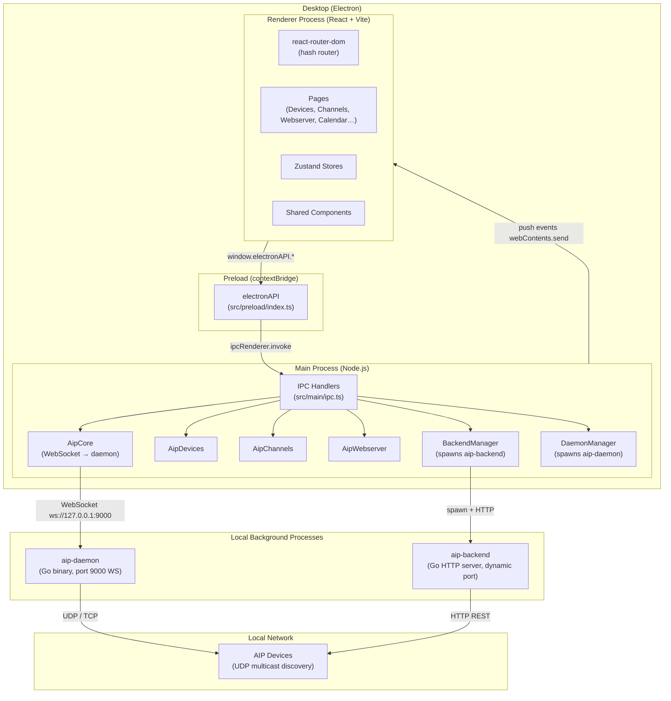
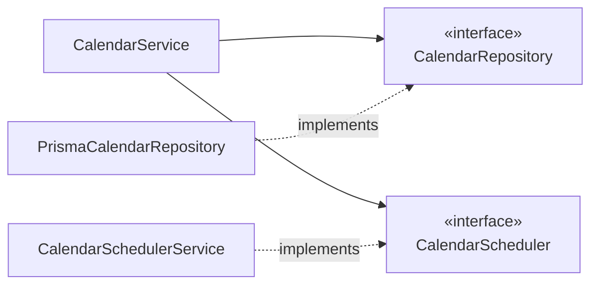
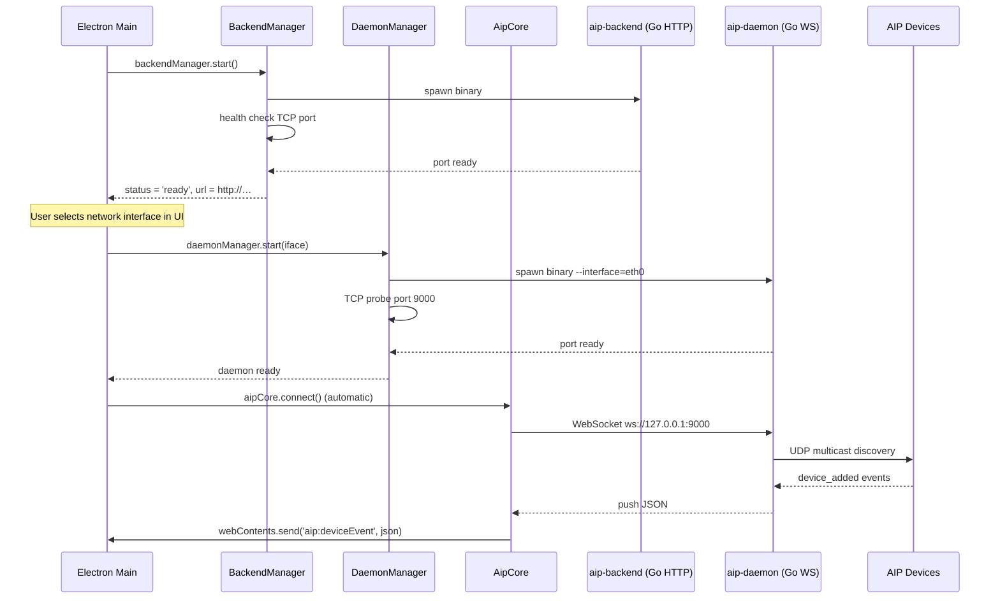

# AIP Go Pro — Project Context

> This document is the single source of truth for any developer or AI agent joining the project.
> Read it entirely before writing any code. Every architectural decision here is intentional.

## Table of Contents

1. [What This Application Does](#what-this-application-does)
2. [Technology Stack](#technology-stack)
3. [System Architecture](#system-architecture)
4. [Process Model](#process-model)
5. [Source Tree](#source-tree)
6. [Data Flow Patterns](#data-flow-patterns)
7. [Feature Status](#feature-status)
8. [Code Conventions — Non-negotiable Rules](#code-conventions)
9. [Clean Architecture Checklist](#clean-architecture-checklist)
10. [SOLID Principles in Practice](#solid-principles-in-practice)
11. [Design Patterns in Use](#design-patterns-in-use)
12. [Adding a New Feature — Step-by-step](#adding-a-new-feature)
13. [Integration Validation Gate](#integration-validation-gate)

---

## What This Application Does

**AIP Go Pro** is a professional desktop management console for Fonestar AIP (Audio over IP) devices. It is distributed as a standalone Electron application for Windows and Linux.

AIP devices are networked audio hardware units (players, amplifiers, intercoms, gateways, sound meters, etc.) that communicate over a local area network. This application lets operators:

- Discover and configure AIP devices on the network
- Manage audio channels (create, play, pause, stop, link to devices)
- Configure SIP extensions and SIP conferences (WebRTC/VoIP telephony integration)
- Manage files on devices (upload/download audio files over FTP)
- Schedule timed events (play a message, activate a scene, stream audio) via a calendar
- Manage web-server configuration on AIP-GATE and AIP-WEB devices

The application is **not a web app**. It is an Electron desktop app that communicates with two local background processes: a Go daemon (`aip-daemon`) and a Go HTTP backend (`aip-backend`).

---

## Technology Stack

| Layer | Technology | Version |
|---|---|---|
| Desktop shell | Electron | 33 |
| Build system | electron-vite | 2 |
| Frontend framework | React | 18 |
| Frontend language | TypeScript | 5.7 |
| Styling | Tailwind CSS | 3 (darkMode: 'class') |
| Routing | react-router-dom | 6 |
| State management | Zustand | 5 |
| Internationalisation | i18next + react-i18next | 26 / 17 |
| Calendar UI | react-big-calendar + rrule + date-fns | 1.19 / 2.8 / 4.1 |
| HTTP client | axios | 1.7 |
| Go daemon | aip-daemon (pre-built binary) | — |
| Go backend | aip-backend (pre-built binary) | — |
| AIP client library | aip-client (local package) | — |
| Database (planned) | Prisma + SQLite | — |
| Packager | electron-builder | 25 |

---

## System Architecture



---

## Process Model

The Electron application has **three JavaScript execution contexts**:

### 1. Main process (`src/main/`)

- Full Node.js access (filesystem, child_process, net, etc.)
- Owns all IPC handlers
- Owns all external process managers (daemon, backend)
- Owns the `AipClient` WebSocket connection
- Receives push events from the daemon and re-emits them to all renderer windows via `webContents.send`
- Will own the Prisma database connection and the calendar scheduler worker

### 2. Preload (`src/preload/index.ts`)

- Runs in the renderer context but with Node.js access
- The **only** bridge between main and renderer
- Exposes a typed `window.electronAPI` object via `contextBridge.exposeInMainWorld`
- No raw `ipcRenderer` access is available to the renderer — only the explicitly listed methods
- The type `ElectronAPI` is derived automatically: `export type ElectronAPI = typeof electronAPI`

### 3. Renderer (`src/renderer/`)

- Standard browser context — no Node.js access
- Can only call `window.electronAPI.*` methods
- Receives push events via listener registrations (`onDeviceEvent`, `onEventFired`, etc.)
- All state lives in Zustand stores

### 4. Worker threads (future — calendar scheduler)

- Isolated Node.js thread created with `new Worker(path)` from the main process
- Communicates only via `parentPort.postMessage` / `worker.on('message')`
- Never touches Electron APIs directly
- Described in detail in `docs/calendar-integration.md`

---

## Source Tree

```
src/
  main/                          Node.js main process
    aip/
      core.ts                    AipCore — WebSocket connection + push event bridging
      devices.ts                 AipDevices — device query / command wrappers
      channels.ts                AipChannels — channel player wrappers
      webserver.ts               AipWebserver — SIP, conference, file transfer wrappers
      index.ts                   Composition root for the AIP module
    backend.ts                   BackendManager — spawns / monitors aip-backend
    daemon.ts                    DaemonManager — spawns / monitors aip-daemon
    ipc.ts                       Registers ALL ipcMain.handle() handlers
    index.ts                     App entry point — window creation, lifecycle hooks

  preload/
    index.ts                     contextBridge — exposes window.electronAPI

  renderer/src/
    App.tsx                      Root component — i18n init, backend polling, AIP events
    main.tsx                     ReactDOM.createRoot entry point
    browserPolyfill.ts           Stubs for Node APIs that leak into the renderer bundle

    router/
      index.tsx                  createHashRouter — all route definitions

    pages/
      Devices.tsx                Device list + detail panel + context menu
      Channels.tsx               Channel player cards
      Webserver.tsx              SIP extensions / conferences / file transfer
      Calendar.tsx               Calendar scheduler (react-big-calendar + rrule)
      Dashboard.tsx              Overview page
      Placeholder.tsx            Stub for unimplemented pages
      NotFound.tsx               404 page

    components/
      Layout.tsx                 TitleBar + Sidebar + <Outlet> shell
      TitleBar.tsx               Custom frameless window title bar
      Sidebar.tsx                Navigation sidebar with groups + items
      Header.tsx                 Page header (dark mode toggle, language selector)
      LanguageSelector.tsx       i18n language picker
      ThemeToggle.tsx            dark/light mode toggle
      ui/
        Badge.tsx                Generic status badge
        VolumeBar.tsx            Audio volume slider
        InterfaceSelectModal.tsx Network interface picker (shown at AIP init)
      channels/
        CreateChannelModal.tsx   Create channel form
      devices/
        DeviceConfigPanel.tsx    Full device configuration panel (tabs)

    store/
      app.store.ts               Global app state (backend status, sidebar open)
      devices.store.ts           Device registry (Map<mac, DeviceEntry>)
      device-config.store.ts     Per-device SIP/sound-meter config cache
      webserver.store.ts         Webserver page state (selected device, tab, etc.)
      calendar.store.ts          Calendar page state (view, date, modal, pendingSlot)

    i18n/
      index.ts                   i18next configuration + SUPPORTED_LANGUAGES
      locales/
        en/ es/ pt/ zh/ vi/      One JSON file per namespace per language
          common.json            Shared buttons, statuses
          nav.json               Sidebar navigation labels
          header.json            Header area
          dashboard.json
          devices.json
          channels.json
          webserver.json
          deviceConfig.json
          calendar.json

    api/
      client.ts                  axios instance pointed at aip-backend HTTP API

  shared/                        Imported by BOTH main and renderer — NO Node or browser imports
    ipc.ts                       IPC channel names + all shared TypeScript types
    calendar.ts                  Calendar domain types (CalendarEvent, CalendarAction, etc.)
```

---

## Data Flow Patterns

### Pattern A — Request/response (renderer initiates)

Used for: fetching data, creating/updating records, triggering commands.

```
Renderer                 Preload                  Main
  │                         │                       │
  │ window.electronAPI      │                       │
  │   .aip.getDevices() ───►│ ipcRenderer.invoke    │
  │                         │   ('aip:getDevices')─►│ ipcMain.handle
  │                         │                       │   → aipDevices.getDevices()
  │                         │                       │   → AipClient.getDevicesJson()
  │                         │◄─── JSON string ───────│
  │◄─── JSON string ─────────│                       │
  │ JSON.parse → store       │                       │
```

### Pattern B — Push events (main initiates)

Used for: device discovery, channel state changes, file transfer progress, calendar event fired.

```
Go Daemon               Main Process              Renderer
  │                         │                        │
  │ WebSocket message ──────►│ AipCore callback       │
  │                         │   → BrowserWindow       │
  │                         │       .getAllWindows()  │
  │                         │   → win.webContents     │
  │                         │       .send(channel, json)
  │                         │                    ────►│ ipcRenderer.on listener
  │                         │                        │ → store.applyEvent(json)
  │                         │                        │ → React re-renders
```

### Pattern C — Typed push subscriptions (preload)

The preload wraps every push channel in a typed subscription that returns an unsubscribe function:

```typescript
onDeviceEvent: (cb: (json: string) => void): (() => void) => {
  const listener = (_e: Electron.IpcRendererEvent, json: string) => cb(json)
  ipcRenderer.on(IPC.AIP.DEVICE_EVENT, listener)
  return () => ipcRenderer.removeListener(IPC.AIP.DEVICE_EVENT, listener)
}
```

The renderer stores the cleanup function and calls it in `useEffect` cleanup:

```typescript
useEffect(() => {
  const unsub = window.electronAPI.aip.onDeviceEvent((json) => store.applyEvent(json))
  return unsub
}, [])
```

---

## Feature Status

| Feature | Frontend | IPC | Backend |
|---|---|---|---|
| Device discovery + list | Complete | Complete | Go daemon |
| Device configuration panel | Complete | Complete | Go daemon |
| Audio channels | Complete | Complete | Go daemon |
| Webserver (SIP + files) | Complete | Complete | Go daemon |
| Calendar / scheduler | Complete | Complete (mock) | **Not started** |
| Dashboard | Partial | Partial | — |
| Messages (audio library) | Placeholder | — | — |
| Sonometers | Placeholder | — | — |
| Action control | Placeholder | — | — |
| Events | Placeholder | — | — |
| Scenes | Placeholder | — | — |
| Transfers | Placeholder | — | — |
| SIP Devices | Placeholder | — | — |
| Log | Placeholder | — | — |

**Mock stores:** The Calendar IPC handlers in `src/main/ipc.ts` use an in-memory `Map` with 5 seed events. The replacement path is documented in `docs/calendar-integration.md`.

---

## Code Conventions

These are **non-negotiable**. Every pull request is reviewed against them.

### Comments

- Use `/** Doxygen block comments */` for public APIs, types, and functions.
- Use `// plain inline comments` for implementation notes.
- **Never** use decorative ASCII separator lines: `// ─── Section ───────────────`. This style is explicitly banned. Use a blank line + plain comment instead.

### Commits

- Format: `type(scope): description` — conventional commits.
- Types: `feat`, `fix`, `refactor`, `style`, `docs`, `chore`, `test`.
- No trailing `Co-Authored-By` trailers.
- One logical change per commit. Do not batch unrelated changes.

### TypeScript

- Strict mode is on. No `any` unless absolutely necessary and commented.
- Types in `src/shared/` must import nothing from Node.js or the browser. They are used by both the main process and the renderer.
- Prefer `interface` over `type` for object shapes. Use `type` for unions and aliases.
- Export types explicitly: `export type { Foo }` when re-exporting from an index.

### React / Renderer

- Functional components only. No class components.
- One component per file. File name = component name.
- State that spans routes lives in a Zustand store. State that is local to a component stays in `useState`.
- All user-visible strings go through `useTranslation(namespace)`. No hardcoded UI text.
- Tailwind for all styling. No CSS modules, no `styled-components`, no inline style objects except when the value is dynamic (e.g. a hex color from data).

### IPC

- All channel names live in `src/shared/ipc.ts` under the `IPC` constant. Never hardcode strings in `ipcMain.handle` or `ipcRenderer.invoke`.
- Every channel exposed to the renderer must be declared in `src/preload/index.ts`. The renderer has zero direct `ipcRenderer` access.
- New channels follow the namespace convention: `domain:verb` (e.g. `calendar:create`, `aip:getDevices`).

### File naming

- Main process modules: `camelCase.ts`
- React components: `PascalCase.tsx`
- Zustand stores: `kebab-case.store.ts`
- Shared types: `kebab-case.ts`

---

## Clean Architecture Checklist

Every new feature that involves persistence or background work must pass this checklist before a PR is opened.

```
Domain layer (src/main/<feature>/domain/)
  [ ] Pure TypeScript interfaces and value objects
  [ ] No imports from @prisma/client, electron, express, or any I/O library
  [ ] Repository interface defined (e.g. FooRepository.ts)
  [ ] Scheduler / executor interface defined if applicable

Infrastructure layer (src/main/<feature>/infrastructure/)
  [ ] PrismaFooRepository implements FooRepository
  [ ] FooMapper handles all JSON serialisation / deserialisation
  [ ] No business logic — only data translation

Application layer (src/main/<feature>/application/)
  [ ] FooService contains all use-cases
  [ ] FooService depends on interfaces, not concrete classes
  [ ] Each method = one use-case (list, get, create, update, delete, …)

Composition root (src/main/<feature>/index.ts)
  [ ] All concrete classes are instantiated here
  [ ] initFoo(prisma) returns the FooService interface
  [ ] No global singletons exported except through the init function

IPC (src/main/ipc.ts)
  [ ] Handlers delegate immediately to the service — no logic inside handle()
  [ ] Channel names from IPC.FEATURE.* constants

Shared types (src/shared/<feature>.ts)
  [ ] No Node.js or browser-only imports
  [ ] All timestamps as ISO 8601 strings (never Date objects)
  [ ] Discriminated unions with a type field for polymorphic payloads

Preload (src/preload/index.ts)
  [ ] All new channels explicitly listed
  [ ] Push channels return an () => void unsubscribe function
  [ ] ElectronAPI type updates automatically (typeof electronAPI)

Renderer
  [ ] Store only holds UI state — no business logic
  [ ] Component calls window.electronAPI, updates store, done
  [ ] All strings translated (useTranslation)
  [ ] New route added to src/renderer/src/router/index.tsx
  [ ] New sidebar item added if the route is top-level navigation
```

---

## SOLID Principles in Practice

### S — Single Responsibility

Each class has exactly one reason to change.

| Class | Responsibility |
|---|---|
| `AipCore` | Owns the WebSocket connection to the daemon and bridges push events |
| `AipDevices` | Device query and command wrappers |
| `CalendarService` | Calendar use-case orchestration |
| `PrismaCalendarRepository` | Calendar persistence via Prisma |
| `CalendarEventMapper` | Prisma record ↔ domain model conversion |
| `CalendarSchedulerService` | Worker lifecycle and message routing |
| `CalendarActionExecutor` | Executes the AIP action when an event fires |

If you find yourself adding a method to a class that doesn't fit its existing name, it belongs in a new class.

### O — Open / Closed

The system is open for extension, closed for modification.

**Example — adding a new action type (`dmx`):**
1. Add `CalendarActionDmx` to the `CalendarAction` union in `shared/calendar.ts`
2. Add a `case 'dmx'` in `CalendarActionExecutor.execute()`
3. Add the UI fields in `Calendar.tsx` EventModal for the new type
4. No changes to `CalendarService`, `CalendarRepository`, `CalendarSchedulerService`, or the database schema

**Example — adding a new recurrence frequency:**
1. Add the string to `RecurrenceRule.freq` union in `shared/calendar.ts`
2. Add the RRule mapping in `scheduler.worker.ts` and `Calendar.tsx` `freqMap`
3. Add the `<option>` to the recurrence dropdown and translation keys

### L — Liskov Substitution

Every interface implementation is fully substitutable.

`PrismaCalendarRepository` satisfies `CalendarRepository` completely. The test double for `CalendarRepository` in unit tests can return any data — `CalendarService` never notices.

### I — Interface Segregation

Interfaces expose only what their clients need.

`CalendarRepository` does not expose Prisma types. `CalendarScheduler` does not expose worker thread details. The renderer's `window.electronAPI.calendar` does not expose Node.js primitives.

### D — Dependency Inversion

High-level modules (`CalendarService`) depend on abstractions (`CalendarRepository`, `CalendarScheduler`). Low-level modules (`PrismaCalendarRepository`, `CalendarSchedulerService`) depend on the same abstractions. The composition root wires them together.



---

## Design Patterns in Use

### Repository

**Where:** Every feature with persistence (`AipWebserver` for SIP/files, `PrismaCalendarRepository` for calendar).

**Rule:** The application layer never calls Prisma directly. Always through the repository interface.

### Mapper

**Where:** `CalendarEventMapper` (and equivalent mappers for each Prisma model).

**Rule:** JSON serialisation happens only in the mapper. Never in the service or repository.

### Service / Use-case

**Where:** `CalendarService`, `AipDevices`, `AipChannels`, `AipWebserver`.

**Rule:** One public method per use-case. The method does exactly one thing and delegates to the repository and/or domain services.

### Observer

**Where:** The entire push-event system (daemon → `AipCore` callbacks → `webContents.send` → preload listeners → Zustand stores).

**Rule:** Emitters do not know about consumers. The preload listener returns an unsubscribe function. The renderer calls it in `useEffect` cleanup to prevent memory leaks.

### Strategy

**Where:** `CalendarScheduler` interface — `CalendarSchedulerService` (worker thread), test double (in-memory), future OS cron strategy.

**Rule:** `CalendarService` selects no concrete strategy. The composition root injects it.

### Composition root

**Where:** `src/main/aip/index.ts`, `src/main/ipc.ts`, `src/main/calendar/index.ts`.

**Rule:** Dependencies are constructed and wired in one place. No service locators. No `getInstance()` singletons leaked between modules.

### Factory function

**Where:** `initCalendar(prisma)` returns a `CalendarService` ready to use.

**Rule:** Callers receive the fully-constructed service. They never call `new ConcreteClass()` directly.

---

## Adding a New Feature

Use this checklist every time a new page, background service, or persistence concern is added.

### Step 1 — Define shared types

```
src/shared/<feature>.ts
```
- All TypeScript interfaces and unions that are used by both the main process and the renderer
- No Node.js or browser imports
- All timestamps as `string` (ISO 8601), never `Date`
- Use discriminated unions with a `type` field for polymorphic payloads

### Step 2 — Add IPC channels

```
src/shared/ipc.ts  →  IPC.FEATURE = { LIST, GET, CREATE, … }
```

Use the naming convention `feature:verb` (lowercase, colon-separated).

### Step 3 — Build the backend module

```
src/main/<feature>/
  domain/
    <Feature>Repository.ts     interface
    <Feature>Scheduler.ts      interface (if applicable)
  infrastructure/
    Prisma<Feature>Repository.ts
    <Feature>Mapper.ts
  application/
    <Feature>Service.ts
  index.ts                     initFeature(prisma): FeatureService
```

Follow the SOLID checklist above.

### Step 4 — Register IPC handlers

```
src/main/ipc.ts
```

Add handlers that delegate immediately to the service. No logic inline.

### Step 5 — Expose in preload

```
src/preload/index.ts
```

Add all new channels. Push channels must return `() => void`.

### Step 6 — Create the Zustand store

```
src/renderer/src/store/<feature>.store.ts
```

UI state only (selected row, modal open/closed, loading flag, error). No business logic. No API calls.

### Step 7 — Create locale files

```
src/renderer/src/i18n/locales/{en,es,pt,zh,vi}/<feature>.json
```

Then import and register in `src/renderer/src/i18n/index.ts`.

### Step 8 — Add sidebar entry and route

```
src/renderer/src/components/Sidebar.tsx   →  add icon + nav item
src/renderer/src/i18n/locales/*/nav.json  →  add label in all 5 languages
src/renderer/src/router/index.tsx         →  add route
```

### Step 9 — Build the page

```
src/renderer/src/pages/<Feature>.tsx
```

- `useTranslation('<feature>')` at the top of every sub-component
- Load data in `useEffect` → `window.electronAPI.<feature>.list()`
- Write to store, never hold large data in component state
- Subscribe to push events if applicable

### Step 10 — Validate against the Integration Validation Gate

---

## Integration Validation Gate

Before merging any PR, the author must verify each item:

```
Architecture
  [ ] No Prisma/Node imports in src/shared/
  [ ] No business logic inside ipcMain.handle() callbacks
  [ ] No React/DOM imports in src/main/ or src/shared/
  [ ] Domain interfaces defined before concrete classes
  [ ] Composition root is the only place new ConcreteClass() is called

Code quality
  [ ] No hardcoded UI strings (all through i18next)
  [ ] No hardcoded IPC channel strings (all through IPC.* constants)
  [ ] All IPC channels declared in src/preload/index.ts
  [ ] Push event subscriptions return an unsubscribe function
  [ ] useEffect cleanup calls the unsubscribe function
  [ ] No ASCII separator comments (// ─── … ───)

TypeScript
  [ ] npx tsc --noEmit --project tsconfig.web.json → 0 errors
  [ ] npx tsc --noEmit --project tsconfig.node.json → 0 errors
  [ ] No usage of any without a comment explaining why

i18n
  [ ] New namespace JSON files created for all 5 languages (en es pt zh vi)
  [ ] Namespace imported and registered in src/renderer/src/i18n/index.ts
  [ ] New nav items added to all 5 nav.json files if a sidebar entry was added

SOLID
  [ ] Each new class has a single stated responsibility
  [ ] New features extend existing interfaces, not modify existing classes
  [ ] High-level service depends on interface, not concrete class
  [ ] Interface exposes only what the consumer needs
```

---

## Background Process Architecture



---

## Key Constraints and Gotchas

### The window has no native frame

`frame: false` is set in `BrowserWindow`. The custom `TitleBar` component handles minimize/maximize/close via IPC channels `window:minimize`, `window:maximize`, `window:close`. The titlebar region uses `-webkit-app-region: drag` CSS. Do not add interactive elements inside the drag region without `-webkit-app-region: no-drag`.

### The renderer cannot use Node.js APIs

`contextIsolation: true` and `nodeIntegration: false` are enforced. If you need a Node.js capability from the renderer, add it to the preload bridge — never enable `nodeIntegration`.

### Shared types must be pure TypeScript

`src/shared/` is imported by Vite (browser build) and by tsc (Node build). Any accidental Node.js import in a shared file causes the renderer build to fail.

### aip-daemon must be running for AIP features to work

The device list, channels, SIP, and file transfer features all require `aip-daemon` to be running. In development, build the Go binary with `npm run daemon:build && npm run daemon:copy:linux`. Without it, the AIP features show empty state silently.

### Timezone discipline

All dates stored and transmitted as ISO 8601 UTC strings. Convert to local time only in form inputs (`datetime-local`). Use `date-fns parseISO` for parsing, never `new Date('YYYY-MM-DD')` (parsed as UTC midnight by browsers, causing off-by-one day bugs in local timezones).
